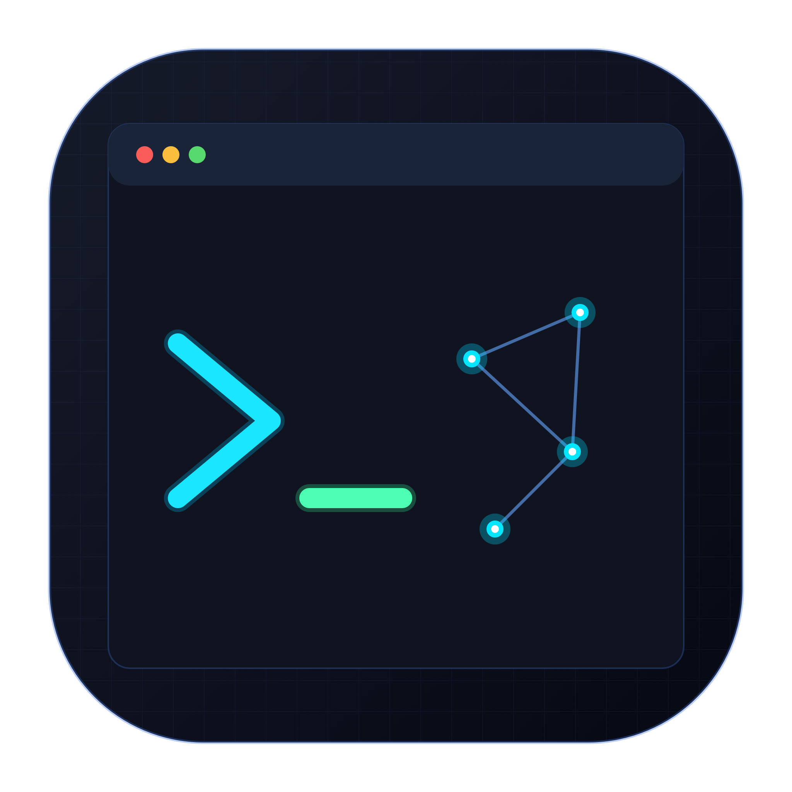

# AeroTerm

<div align="center">
  
  <h3>轻量级、毫秒冷启动的现代原生 macOS SSH、网络运维与 AI Agent CLI 工作台</h3>
  <p>纯 Swift 6 + SwiftUI + SwiftTerm 开源终端后端打造 | 独立包仅 26 MB（含 Cascadia Code NF 字体族与全套离线图标）</p>
</div>

---

## ✨ 核心特性

### 1. 独立纯正 Xcode 风格启动窗口 (Xcode Startup Window)
- **固定 780x480 尺寸**：底层 AppKit 窗口拦截，彻底禁用拉伸、双击标题栏放大与 `Globe+F` 全屏；
- **macOS 原生单红灯关闭控制**：隐藏黄绿灯，纯正 Xcode 原装交互；
- **140x140 高清大 Logo**：搭配 300x300 环境柔和弥散背光与毛玻璃右侧最近连接直达栏。

### 2. 840x600 左右两栏专业新建向导 (New Connection Wizard)
- **四大业务分类**：
  1. 🌐 **Remote Connection** (SSH, SFTP, Telnet)
  2. 🛠️ **Debugging Tools** (TCP Client/Server, UDP Tool, Serial Port, HTTP API)
  3. 🖥️ **Remote Desktop** (VNC, RDP)
  4. ✨ **AI & Agent CLI** (从 XML 动态读取渲染的 6 大 Agent CLI)
- **防折行单行布局**：左侧 240px 专属导航栏，选中状态绝对单行对齐；
- **100% 本地化覆盖**：全弹窗与字段多语言规范支持。

### 3. 6 大核心 AI Agent CLI 预设与 XML 动态扩展体系
- **标准预设**：
  - 🌟 **Claude Code CLI** (`claude`，Anthropic 官方智能体)
  - 🤖 **Codex CLI** (`codex`，OpenAI 代码推理与开发环境)
  - 🚀 **Antigravity CLI** (`agy`，Google DeepMind 高级智能体编码环境)
  - ⚡ **Grok CLI** (`grok`，xAI 实时推理智能体)
  - 🪽 **Hermes CLI** (`hermes`，Nous Research 开源推理智能体)
  - 🛠️ **Custom Agent CLI** (`/bin/zsh`，自定义脚本与本地二进制)
- **XML 动态配置**：`Sources/AeroTerm/Resources/agent_cli_configs.xml` 支持热扩展；
- **离线高清图标库**：内嵌 6 大 256x256 高清透明 PNG 图标，0 网络依赖秒开。

### 4. 集成顶级开源终端后端 (SwiftTerm)
- **内核级 PTY 伪终端**：彻底解决 Go Bubbletea / Inquirer / Claude Code 的 `/dev/tty` 报错；
- **VT100 / xterm-256color / TrueColor**：完整支持 Alternate Screen Buffer、Vim、Nano、Top、Htop 与鼠标交互；
- **exit 自动关闭页面**：终端输入 `exit` 或按 `Ctrl+D` 自动平滑关闭当前标签页；
- **SSH 通用终端复用**：已为 Phase 2 SSH 远程引擎预留通用 `TerminalView` 接入通道。

### 5. 独立主题与 Cascadia Code NF 字体体系
- **主题系统**：Aero Dark (Midnight Neo) 与 Aero Light (Solar Mist) 预设，支持 ANSI 16 色调色板；
- **默认内嵌终端字体**：提取内嵌 Cascadia Code NF Nerd Font 4 大字重并支持 CoreText 进程内自动注册。

---

## 🚀 快速启动

```bash
# 启动独立打包的 Release 应用
open ./dist/AeroTerm.app

# 或使用 release 脚本重新打包
./scripts/build_app.sh release
```

---

## 📄 开源许可证 (License)

本项目采用 **[MIT License](LICENSE)** 开放源代码许可证。您可以自由地商用、修改、分发与私用。

---

## 📚 协同与技术文档

- [INDEX.md](INDEX.md) —— 多 Agent 协同主索引、架构规范与全量进度记录
