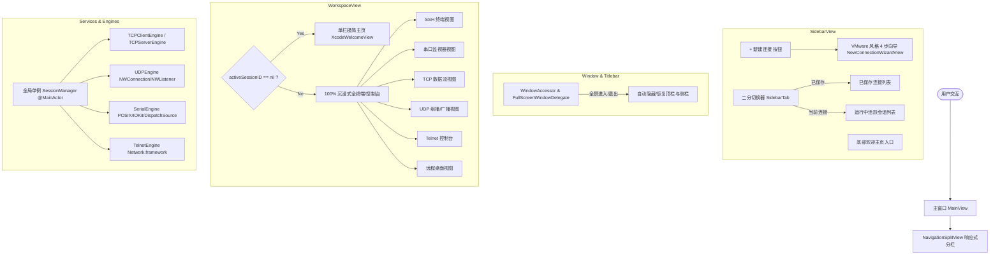

# AeroTerm 架构设计白皮书与技术实现思路

## 1. 项目定位与核心愿景
**AeroTerm** 旨在打造一款真正轻量、极速冷启动、超低内存占用的现代 macOS 原生 SSH & 网络/远程运维工作台。
- **痛点对标**：Termius / Electerm 等基于 Electron 的工具动辄占用 200MB+ 磁盘空间与数百兆常驻内存。
- **原生优势**：纯 Swift 6 + SwiftUI + Apple Network.framework 打造，独立 `.app` Release 包体积仅 **4.0 MB**，毫秒级冷启动，内存占用仅 20~40MB。

---

## 2. 整体系统架构图

---

## 3. 核心机制与关键技术难点落地

### 3.1 零闪退生命周期与资源安全释放 (Zero-Crash Lifecycle)
- **挑战**：在 SwiftUI 中，如果用户关闭会话的一瞬间立即释放底层 Socket 或 IOKit 串口资源，由于当前渲染帧视图树尚未卸载，可能发生野指针访问（EXC_BAD_ACCESS）。
- **解决方案**：
  1. 在 `SessionManager.closeSession(id)` 中，先安全更新 `activeSessionID` 并从 `sessions` 列表中摘除；
  2. 延迟 `0.05s` 异步释放底层 Engine；
  3. 各 Engine（`SerialEngine`, `TCPClientEngine`, `UDPEngine`, `TelnetEngine`）内部统一配备 `isDisposed` 状态标志与加锁保护，防止异步回调向已释放的实例写入数据。

### 3.2 串口打开前置安全拦截 (Pre-Flight Serial Check)
- 在用户尝试打开串口前，首先调用 `SerialEngine.getAvailablePorts()` 检测系统 `/dev/cu.*` 设备；
- 若无可用设备或打开失败（无权限/被占用），**直接拦截，不创建 Tab 页面，不进入无效视图**，并通过全局原生 Alert 提示用户。

### 3.3 macOS 全屏沉浸与自动隐藏/恢复顶栏 (Full-Screen Auto-Hide)
- 基于 `FullScreenWindowDelegate` 监听 `windowDidEnterFullScreen` 与 `windowDidExitFullScreen`；
- **全屏进入时**：
  - `window.toolbar?.isVisible = false`
  - `window.titleVisibility = .hidden`
  - `columnVisibility = .detailOnly`（侧栏隐藏）
  - 右侧终端 100% 铺满整个显示器；
- **顶部边缘唤醒**：鼠标移动到屏幕最顶端边缘时，系统顶栏与绿色退出全屏按钮自动滑出；
- **退出全屏时**：所有控件平滑恢复原状。

### 3.4 极简主义设计哲学 (Minimalism UI)
- **左侧**：仅保留“+ 新建连接”、二分切换器（左：已保存 / 右：当前连接）、已保存列表/当前运行列表、底部主页入口。
- **右侧**：彻底去除多余的顶栏横线与 TabBar，打开会话即享受 100% 可视面积的全屏终端；
- **主页**：单一的“新建连接”大按钮 + 居中嵌入的最近连接记录列表。
